# PPAKGOM

**스터디 중심의 화상회의 플랫폼**

**프로젝트 기간 : 2021.07.12 ~ 2021.08.20**

     

   

 

## 개발자

팀장 이광교

팀원 송지연

팀원 신준희

팀원 이진영

팀원 천주용

 

## 프로젝트 소개

관심사 검색을 통해 원하는 **스터디**를 빠르게 구하고 **열정적인 스터디원**을 찾아서 함께 **빡곰**하는 **스터디 중심의 화상회의 플랫폼**

### 목적

- 코로나로 인해 오프라인 스터디가 힘든 지금, 온라인으로 스터디를 지원합니다.
- 관심분야를 통해 스터디, 스터디원을 찾을 수 있고 열정도를 보면서 좋은 팀원과 함께 할 수 있습니다.
- 공부나 관심 분야 공유를 하고 싶은 사람들 누구나 이용할 수 있고 특히, 취업 준비생의 취뽀를 응원합니다🙂

 

## 협업 규칙

### Notion

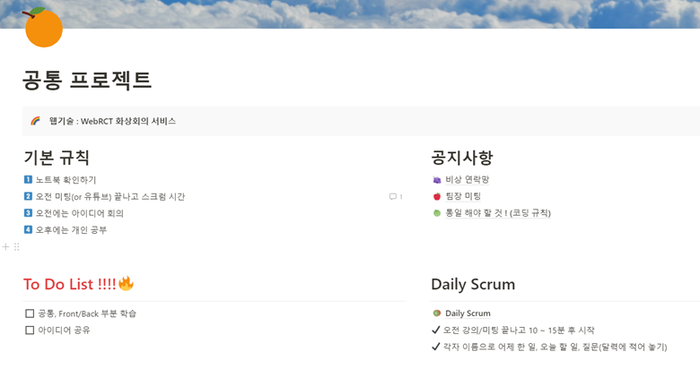

### 학습 공유

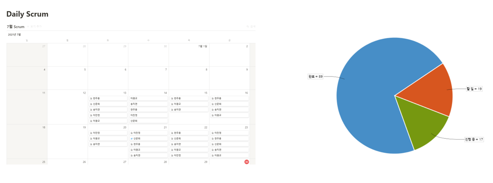

### Git Convention

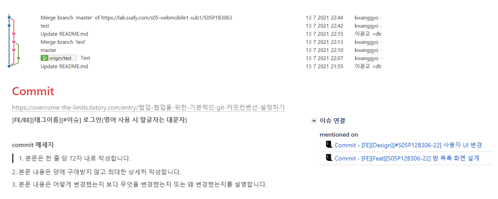

 

## 기획

### 아이디어 회의

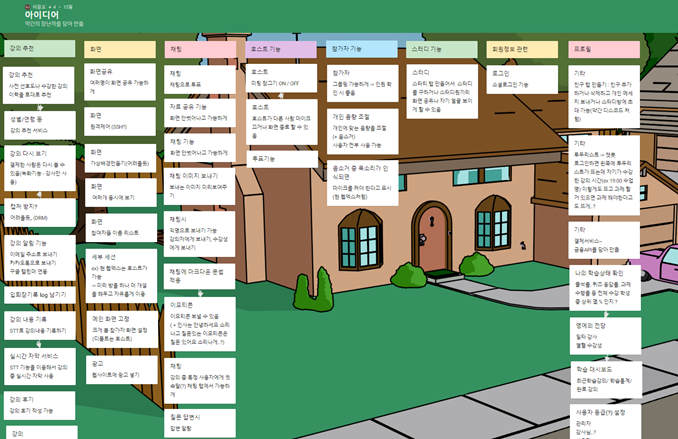

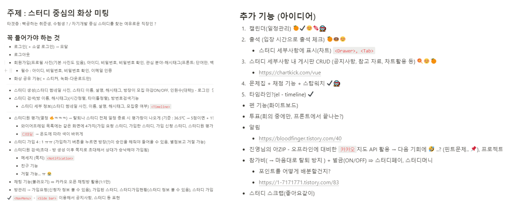

### UI

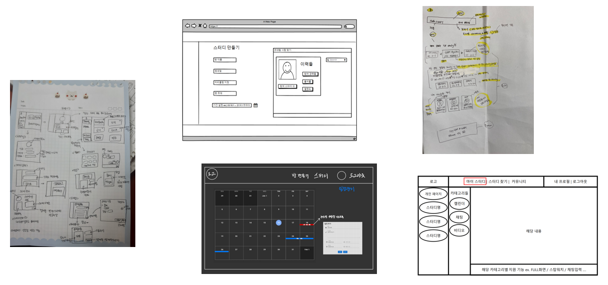

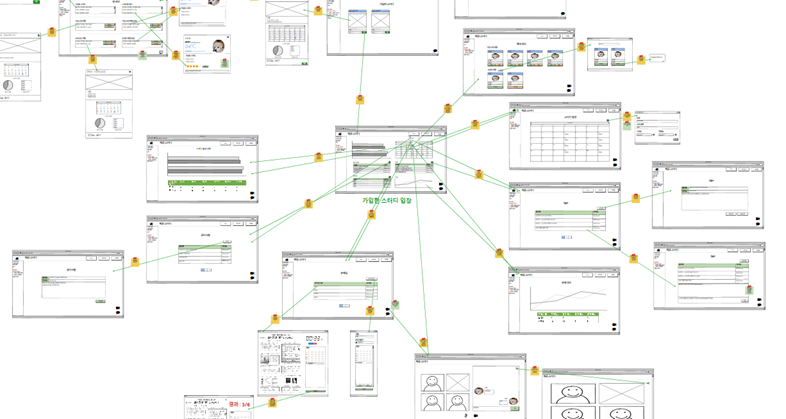

### ERD

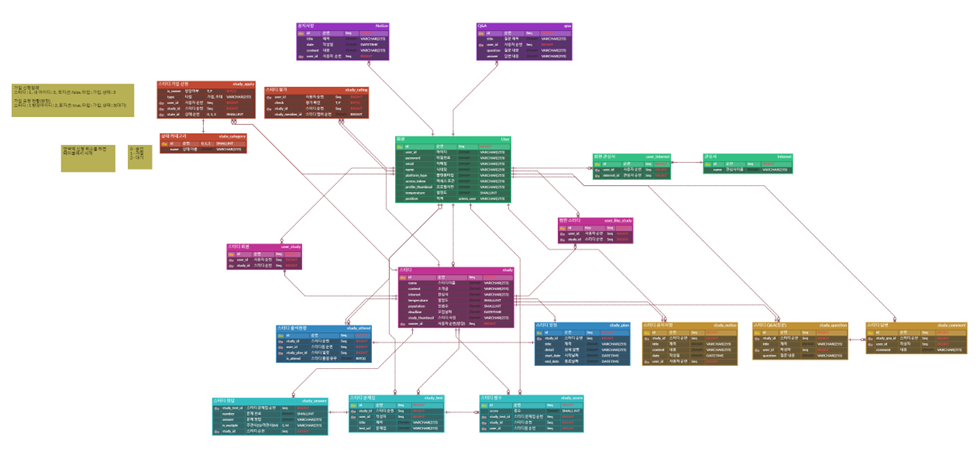

### 아키텍쳐

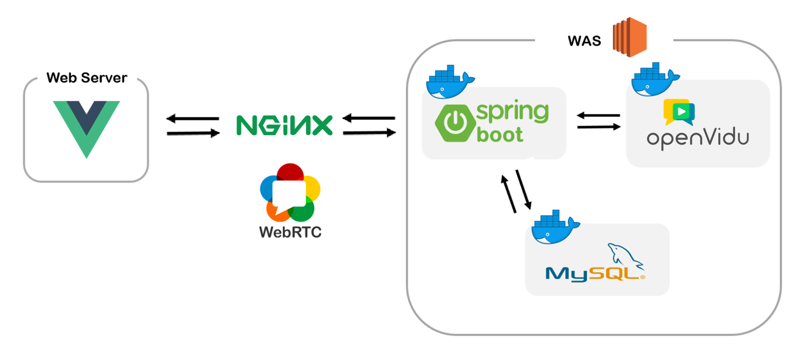

 

## 개발 현황

**스터디 검색**

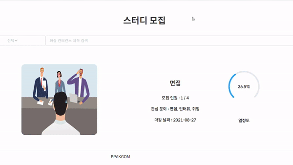

**스터디 생성**

**스터디 가입**

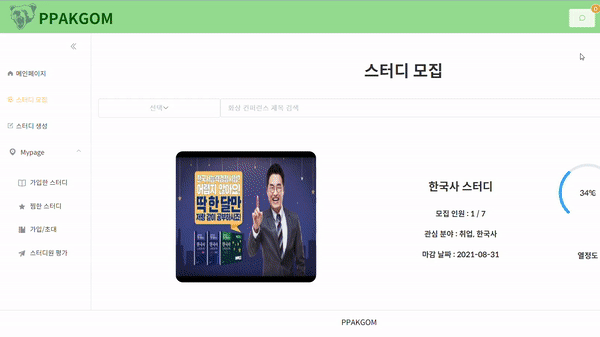

**스터디 일정&출석**

**스터디 찜하기**

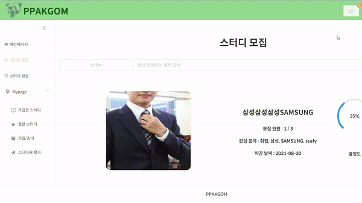

**스터디 초대**

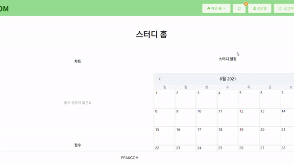

**스터디원 평가**

**문제집 생성**

**문제풀기&결과**

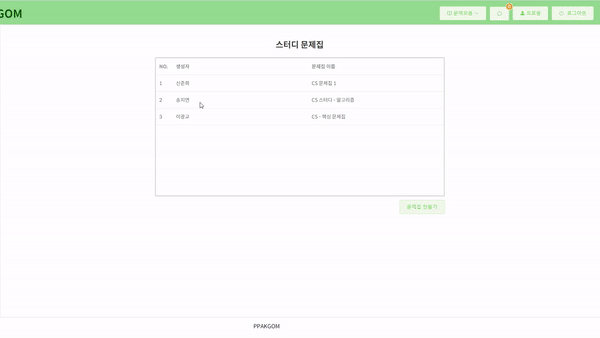

 

